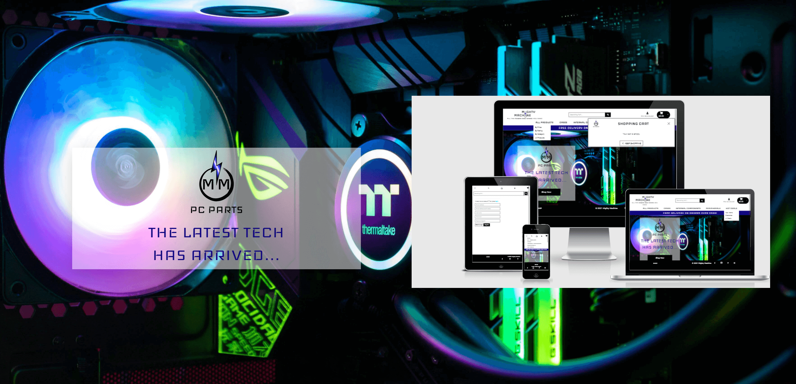

# [Mighty Machine](https://gazroh87-mighty-machine.herokuapp.com/) - PC Parts E-Commerce Web App

View the live website [here](https://gazroh87-mighty-machine.herokuapp.com/)

## Code Institute - Final Milestone Project 4 - Full Stack Frameworks with Django

*Note: My project builds upon large portions of the code sourced from Code Institute's Django [Boutique Ado](https://github.com/ckz8780/boutique_ado_v1) 
project tutorials.*

***

# I N T R O

I've built an E-commerce website for selling PC components/accessories. The reason for choosing the name 
'Mighty Machine' comes from the idea that if someone or something, such as a computer built for a primary purpose 
such as gaming, has a combination of both great power and speed or some other similar attribute(s), it can be called 
mighty, and a user of my website can purchase everything they need to build a 'Mighty Machine' for such purpose from 
my website. Users can 

This application is primarily aimed towards custom PC builders, gamers, tech nerds and video editors and anyone else 
who might require a powerful computer to build themselves or have someone build for them. The overall modern styling 
mixed with tech/scifi font and imagery helps to increase appeal.

The primary aim of this application was to allow users (registered or unregistered) to purchase products, from 
landing on the homepage, to successfully completing a purchase. Registered users are also able to review any product 
available for purchase on the website for others to see. I chose to develop an E-Commerce shop as it is in someways a 
fairly complex but highly flexible application to challenge my understanding, and build upon my knowledge along the 
way, of the technologies involved. Because of the sensitivity surrounding the handling of customer details, a great 
deal of security consciosnous is required during the development of an application like this. 

Users can register an account and change their email address, password and other details relating to their account. 
The website has a login page that directs the user to the main store front where they can browse through different 
categories of products. Once a user adds their product(s) to the cart they can then proceed to the checkout, enter in 
their delivery information and purchase their products using the Stripe online payment method. At the moment the 
website stocks a limited variety of categories of products but in future the store has the potential to grow much 
larger and the inventory be greatly expanded upon. A logged in user can view their order history of purchases, directly 
linked to their username.

The store admin(s) will spend most of their time adding, editing and deleting products and categories among other 
typical activities through the [Django admin](https://docs.djangoproject.com/en/3.2/ref/contrib/admin/) backend site,
but they can also do some of the basic tasks through the website's own frontend UI.

## Testing Purchases

*Note: If you wish to try out the app right away and test the purchasing, for ease of use, you do not need 
to register an account on the website.*

Under 'Pay Method'...

Enter:

* 4242 4242 4242 4242 as the **Card number**
* 04/24 as the **expiration date (MM/YY)**
* 424 as the **CVC**
* 42424 as the **ZIP**

***

# U X (User Experience)

* Does this fit my user's needs?
* Does the user like my website?
* Does the user like being at my website?
* Is this a website a user might want to return to in the future?

These are all questions I asked myself throughout the UX design process.

## User Goals and Expectations

### Customer
#### Products
*	I want to see the full range of your products, and be able to purchase one or quickly change how many I have put 
in my shopping cart.
*	I want to be able to view an individual product and find out more details about that product.
*	I want to be able to see at all times, how much my current cart total is so I can see how much I am spending on 
products.
*	I want to be able to see the different categories and be able to sort through them without having to see all the 
products I might not be interested in.
*	I want to be able to search for a specific product to see if it is available for purchase on the website.
*	(FUTURE) I want to see if the product(s) I want is in stock so I know they are available to purchase.

#### Purchasing
*	Once I have selected the items I want to buy and added them to the cart I want a notification with them shown 
added to my cart.
*	I want to be able to be able to change the items in my cart e.g. change quantity of an item or remove it.
*	I want to be able to enter my payment details for the products as quickly and as easily as possible.
*	I want to be sure that my payment information is secure before confirming my payment details at the checkout.
*	I want a confirmation of my order on the site before confirming just to double check that I have not made any 
mistakes.
*	I then want an email confirmation so I know that you have received the order correctly and are processing it.
*   I want to be able to make a purchase wihtout needing to create an account.

### User
*	I want to be able to easily create an account and be able to see the profile that I have created.
*	I want to be able to login easily to view my account and be able to logout easily when I want to leave the 
website.
*	I want to be able to recover my password in case I forget and be able to change if and when I wish to do so.
*	I want to able to easily access my account so I can see my details, order history etc.
*	I want to receive an email confirmation once I have registered to let me know that I created an account 
successfully.

### Admin
*	I want to be able to add a new product on the site.
*	I want to be able to edit or update an existing product on the site.
*	I want to be able to delete and remove a product which I no longer want users to be able to purchase.
*   I want the ability to limit the creation, editing and deletion of products to the superuser(s) with admin access.

## Design Choices

### Colour Scheme

 `#000`
 `#100080`
 `#2000ff`
 `#555`
 `#fff`
 `#198754`
 `#212529`
 `#6c757d`
 `#dc3545`
 `#e9ecef`
 `#ffc107`

The website is heavily reliant on [Bootstrap v5 theme colors.](https://getbootstrap.com/docs/5.0/customize/color/)

White, black and dark shades of blue are the primary colours used for the web app's frontend.

Examples of colour usage:

#### White
* Background
* General buttons
#### Black
* Majority of text
* General buttons
#### Dark shades of blue
* Delivery banner
* Shop Now button hover/active/focus states
* Update links
* Breadcrumbs
#### Secondary
#### Success
* Buttons for adding product(s) to the shopping cart
* Success toasts
#### Danger
* Removing/deleting
* Error toasts
#### Warning
* Edit buttons
#### Dark (off black)

### Typography

* My website uses two fonts from the [Google Fonts](https://fonts.google.com/) library called Iceland and Roboto.
* 'Iceland' is used for most headings, some nav links and as part of the logo design. Roboto is used for all other 
text.
* These fonts are imported via the head element of the base HTML file.
* Sans-serif is the fallback font if for some reason the above fonts can't be imported into the site correctly.
* Both fonts are very popular in the developer world and are also easy enough to read, so they are both attractive 
and appropriate.

## Strategy

The focus of this project is on using the knowledge I have learned of Python and Django to build a responsive 
application, in this case, PC Parts E-Commerce web app to demonstrate to anyone my capabilities in Python and Django 
alongside HTML5 and CSS3, and jQuery/JavaScript.

## Scope

My website's main target users are custom PC builders, gamers, tech nerds and video editors and anyone else 
who might require a powerful computer to build themselves or have someone build for them. 

The scope of this app is to provide a place where anyone, on as many different devices/screen sizes as possible, 
can purchase products and share their honest opinions and experiences with their purchases by posting their own 
product reviews.

My app caters to the basic needs of an administrator by including a variety of tools in order to moderate user 
posted reviews and provide updates to the website with more categories of products to browse through and more 
products to purchase.

I bucket my features into separate lists by priority:

1. 'Will Do' features had to be completed by my given submission deadline for this project. These have one or both of 
the following characteristics: 
    * Upper bound: Meet the requirements of a project based on the project specifications. 
    * Lower bound: Show as much prowess in course material as possible. Show that I can use the different facets of 
    each language (HTML/CSS/JS/Python).
2. 'Stretch Goals' are features to try to implement if I had time left at the end of the project. These should be relatively quick and easy to implement but only if the above features have been completed.
3. 'Won't Do' features are features I won't get done before the project deadline but are features I may want to work on in the future and include in future updates.

### Planned Features

* Fully responsive design - The website should function appropriately across mobile, tablet and desktop devices and 
screen sizes.
* The website should provide suitable mobile and desktop navigation which are simple enough and easy to use.
* The website should provide a searching function for users to find the product(s) they are looking for.
* Website information should be clearly layout from the moment a user lands on the homepage.
* The web app should provide functions to add, edit and delete categories and products.
* The products page should utilise some form of standardised E-Commerce feeding of products to the user and allow 
them to sort and filter products.
* Users should be able to add products to their cart as soon as they see it listed on the products page.
* Registered and logged in users should have the added benefit of being able to post a review for a product on the 
website.
* To maintain an accurate and up to date database, only the superuser(s) can perform CRUD operations on categories 
and products etc.
* The website should provide clear links on well structured pages for increased usability.

## Structure

* When the user lands on the homepage, it will be met with a slideshow of attractive imagery behind text invoking 
the websites purpose.
* A user friendly interface to further increase usability and help encourage users to 
return to the website.
* The navigation bar is always fixed to the top of the viewport and is fully responsive in adjusting itself for 
tablet and mobile users.
* Responsive links which change appearance when hovered over, providing the user with feedback as they navigate 
around the website.
* The products page follows a similar layout to the majority of other E-Commerce shops. The default products page 
includes all available products from every category. Each product is represented as a card with an image of the 
whole product, the product name including brand, a short description, a rating and price.
* If a user wants to view a product, they can find a bit more information.
* If a user adds a product to their cart, they will receive a toast pop-up message, towards the top right of the 
viewport under the cart button in the nav, informing them that they have added 'x' amount of product, and if they 
selected a product in a certain colour, it will tell them in which colour they have added the product into their 
cart.
* On the cart page, users can see all the products they have added including the optional colour they might have 
selected and they can modify the quantities.
* Once a user has proceeded to the checkout, they will be presented with a form to fill out in order to complete 
their checkout. Once the user has completed this, the order will be stored in their order history of their account, 
for them to view at any time.
* I have provided users with the ability to exit pop-ups as soon as they appear via a close button.
* Images are responsive to the device screen size.
* I have provided users with breadcrumbs for them to quickly to steps back in the website without clicking a browser's
back button.
* Every time a user submits some information or an action including registering, logging in/out, interacting with 
product quantities, the cart, or completing a transaction, they are notified by a toast pop-up message that describes 
the result of the action that has just taken place.

## Skeleton

### Wireframes

#### Mobile

[Home/Index]()  |
[Products]() |
[Product Details]() |
[Shopping Cart]() |
[Checkout]() |
[Order confirmation]() |
[Registration]() |
[Login/logout]() |
[Profile]() |

#### Tablet

[Home/Index]() |
[Products]() |
[Product Details]() |
[Shopping Cart]() |
[Checkout]() |
[Order confirmation]() |
[Registration]() |
[Login/logout]() |
[Profile]() |

#### Desktop

[Home/Index]() |
[Products]() |
[Product Details]() |
[Shopping Cart]() |
[Checkout]() |
[Order confirmation]() |
[Registration]() |
[Login/logout]() |
[Profile]() |

***

# F E A T U R E S

## Current Features

There are currently and as a required, a minimum of 3 usertypes for my project to function as it should:
- Superuser(s) / site administrator(s)
- Registered users
- Unregistered users

For all users the user experience is going to be much the same, although, there are some extra features/benefits 
available to registered users and superusers, with superusers having all the extra admin functionality restricted 
to themselves.

Web App Section | Feature | Description
----------------|---------|------------
Top Navigation bar | Fixed navigation bar | Visible across every page and on any device screen size. On smaller widths, it transforms into a hamburger menu. This navigation area includes the website logo, search bar and sets of links for each section/subsection of the website.
Homepage | Slideshow | 5 colourful images of inspirational media including products that can be puchased from the website are animated using a slow fade in and out effect.
Homepage | Jumbotron | The website logo and a brief summary of the kind of products the store sells. The message "The latest tech has arrived..." tells the user that the store is up to date and that they don't have to go anywhere else to find the latest PC Parts available. Below this is the "Shop Now" button, that when clicked on will direct the user to the products page.
Footer | Fixed Footer |  Every page contains the same footer with a shop link to the products page, copyright information and social media links.
Products page | Standard E-Commerce feed of products | Options to sort and filter products by name and price. Each product can be added to the shopping cart immediately and links to an individual product detail page.
Product detail page | Product details | Consists of an image of the product, name, description, rating, price and add to cart button.
Product detail page | Quantity selector | Allows users to increase and decrease the quantity of a product they are thinking of adding to their cart. The minus button decrements the value in steps of 1, while the plus button increments the value in steps of 1.
Shopping cart page | Shopping cart | Consists of product info and images of items currently in the cart along with prices, quantities, colours and sub totals. If a user changes their mind about the quantity of a product, they can update this or remove them entirely.
Checkout page | Details form | User enters their personal details including full name and e-mail address.
Checkout page | Delivery form | User enters their delivery details for their order to be sent to the correct address.
Checkout page | Payment form | User enters their card details. If the user enters incorrect card information, they will be notified that the form is invalid.
Checkout page | Order summary | Details of the order the user is about to purchase. Displays image(s), name(s), quantity, sub totals, order total, delivery charge and grand total.
Order confirmation page | Order confirmation | Below the heading, the user will receive a message letting them know that their order has been confirmed and that they will receive an e-mail confirmation aswell. The confirmations contain the unique order number and the date and time of the transaction. Below this is all the order details including the products, delivery and billing info.
User account | Order history | User accounts are only available to registered/super users who are currently logged in. Users can track their order history at any time.
User account | Shipping details | Users can safely store and view their current delivery details at any time for a faster checkout process.

Other:

Feature | Description
--------|------------
Registration | User registration with link to sign in if user already has an account otherwise the user must fill out the form to create an account.
Logging in | Users can log in to their account or click a button to register for an account if they have not already done so.
Logging out | Users can log out of their account.
Password reset | Users can reset their password by entering their associated e-mail address.

## Django Apps

Mighty Machine is a [Django project](https://docs.djangoproject.com/en/3.1/ref/applications/), consisting of 5 Django 
applications listed below:...

- **Home**
- **Products**
- **Cart**
- **Checkout**
- **Profiles**

As Django's documentation explains - A Django app describes a Python package that provides some set features. The 
same applications can be reused in other projects.

* TO BE UPDATED IN FUTURE

## Future features/improvements to be implemented

- A feature that provides authenticated users with the ability to save favourited products for later viewing/purchasing.
Each product of the products page could have a heart-shape icon link to save the item to their favourites list 
accessible from their profile page. Users could manually remove the items from their list and tick a box or tick boxes 
for individual products, to say the wanted the item automatically removed from the list if they have purchased the 
item.
- A contact page featuring a form to fill out.
- A feature that makes items stay in a users shopping cart after they have logged out. 
- Coupon codes and discounts for customer loyalty.
- An E-mail newsletter feature. During the registration process, the user has the option to tick a box to receive a 
regular newsletter containing personalized product recommendations, discounts and new products coming soon to the store.

Working on this project has been an incredible journey of learning. I just wish I had more time to implement the above 
features.

## Technologies Used
* I have used HTML, CSS, JavaScript and Python programming languages.
* I used Gitpod (https://gitpod.io/) to build the website.
* I used Django as I wanted to utilise a python based web framework for this project.
* I used Django-Allauth (https://django-allauth.readthedocs.io/en/latest/installation.html) for the authentication system of the project as it has the security features I require.
* I used Django Crispy Forms to helps to manage the forms and able adjust forms properties in the backend.
* I used Django Countries which was used for the country field for user to be able to selct the contry they are from.
* I used Stripe to set up the payment methods for the site allowing customers to pay by online card transactions.
* I used Bootstrap for its mobile-first, responsive and simplistic layouts.
* I used Pillow to be able to use the image field for the products on the site.
* I used JQuery (https://jquery.com/) to decrease the amount of JavaScript code in the project.
* I used Font Awesome (https://fontawesome.com) to add the icons used in the site.
* Block templates were used so I don’t have to repeat my code to save time.

## Committing files to GitHub
When I make changes to each file I push them from GitHub from GitPod and below are the steps I do to do this. This is essential as to not losing any of the work I have done.
1.	On my GitPod project scroll down and click on the command prompt at the bottom.
2. Check status by typing in ‘git status’.
3.	Type ‘git add .’ to add all files for staging or 'git add filepath' to add select files by path.
4.	Type ‘git commit -m "Message" to commit the files.
5.	Type ‘git push’ to push the files to GitHub.

## Credits
Product images - 

Product descptions - 

Logo - Was created in 

Code Institte includeing the Boutique Ado project which helped me alot.